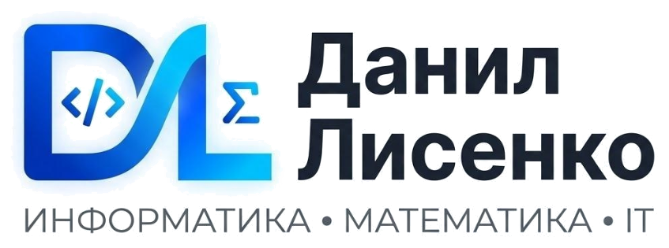

# 💻 Персональный сайт-лендинг репетитора Данила Лисенко

[](https://developer.mozilla.org/ru/docs/Web/HTML)
[](https://developer.mozilla.org/ru/docs/Web/CSS)
[](https://developer.mozilla.org/ru/docs/Web/JavaScript)
[](https://core.telegram.org/bots/api)
[](#)

> **Современный, технологичный и адаптивный сайт-лендинг для действующего инженера-программиста и преподавателя Данила Сергеевича Лисенко.**  
> Разработан для презентации образовательных программ (информатика, математика, подготовка к ОГЭ/ЕГЭ, Python и веб-разработка), интерактивного расчёта стоимости, демонстрации дипломов и опыта, а также автоматического сбора заявок в Telegram.

---

## 📸 Превью проекта



---

## 🌟 Ключевые особенности и функциональность

### 1. ⚡ Автоматическая отправка заявок в Telegram-бот
- **Telegram Bot API:** При оформлении заявки через форму на сайте или всплывающее модальное окно данные мгновенно форматируются и отправляются в личный Telegram-чат преподавателя.
- **Информативность:** В заявке указываются имя клиента, контакт для связи, предпочтительный канал ответа (Telegram, Макс, VK), выбранное направление обучения, формат занятий и комментарий с классом ученика.
- **Безопасность:** Реализовано экранирование спецсимволов для корректной доставки HTML-сообщений через Telegram Bot API.

### 2. 🎛️ Интерактивный калькулятор стоимости и подбора программы
- Динамический выбор предмета (Информатика, Математика, Python & IT), уровня подготовки (5–8 классы, ОГЭ, ЕГЭ, IT с нуля, студенты) и формата занятий (Онлайн / Очно с выездом в Челябинске).
- Мгновенный пересчёт стоимости пробного урока и основных занятий в реальном времени без перезагрузки страницы.
- Автоматическая генерация рекомендаций по темпу занятий (количество уроков в неделю и ключевой фокус программы).

### 3. ⏳ Экран загрузки (Preloader)
- Плавный экран предзагрузки с фирменным логотипом и светящейся анимацией, предотвращающий мерцание и пустой экран при открытии сайта.
- Интеллектуальный прогресс-бар с анимацией shimmer, плавно наполняющийся до 100% при загрузке страницы (`window.load`) со страховочным таймером.

### 4. 🎨 Фирменный брендинг и дизайн-система
- **Векторная графика и прозрачность:** Логотипы и фирменный знак DL подготовлены с прозрачным альфа-каналом без фоновых рамок и артефактов.
- **Тёмные и светлые версии логотипа:** В шапке сайта используется минималистичный символ **DL**, в прелоадере и тёмном подвале — контрастная тёмная версия (`logo-full-dark.png`), а в шапке оферты — полноцветный светлый вариант (`logo-full.png`).
- **Цветовая палитра:** Профессиональные оттенки глубокого индиго (`#0f172a`), сапфирового синего (`#2563eb`), яркого циана (`#38bdf8`) и нейтрального серого.

### 5. 🎓 Подтверждённая квалификация и лайтбокс документов
- Интерактивный просмотр документов государственного образца (Диплом бакалавра ЮУрГУ ФИИТ, Сертификат Университета Иннополис, сюжеты регионального телевидения).
- Полноэкранный модальный лайтбокс с зумом и подробными поясняющими подписями.

### 6. 📜 Юридическая чистота (Публичная оферта)
- Отдельная юридически выверенная страница Публичной оферты ([oferta.html](oferta.html)) на оказание образовательных услуг и репетиторства.
- Чётко зафиксированные условия ценообразования, порядок поэтапной оплаты (50/50), правила отмены и переноса уроков.

### 7. 📱 Полная адаптивность (Mobile First)
- Адаптация под все разрешения экранов: смартфоны (iOS, Android), планшеты, ноутбуки и Ultra-Wide мониторы.
- Боковое выезжающее мобильное меню (Drawer) с удобной навигацией.
- Плавающий интерактивный виджет быстрой связи (FAB) для перехода в мессенджеры в один клик.

### 8. 🌐 Техническая упаковка и SEO
- Настроены мета-теги **OpenGraph** для отображения красивых карточек-превью при отправке ссылок в Telegram, WhatsApp и ВКонтакте.
- Векторная адаптивная фавиконка (`favicon.svg`).

---

## 📞 Прямые каналы связи с преподавателем

- **Telegram:** [@Daaniiiiillll](https://t.me/Daaniiiiillll)
- **Телефон / WhatsApp:** [+7 (951) 260-59-11](tel:+79512605911)
- **Мессенджер «Макс»:** [Диалог в Макс](https://max.ru/u/f9LHodD0cOLxJzj63nASr6si_iYuyGz2HY-qIaEtjhyqRDN6lv5kBx9fHdI)
- **ВКонтакте:** [vk.com/danillisenko](https://vk.ru/danillisenko)
- **Email:** [danillisenko7@gmail.com](mailto:danillisenko7@gmail.com)
- **Город:** Челябинск (онлайн по всей РФ / очно с выездом)

---

## 🛠️ Стек технологий

- **HTML5:** Семантическая вёрстка, доступность (a11y), разметка OpenGraph.
- **CSS3:** Flexbox, CSS Grid, Custom Properties (CSS-переменные), адаптивная верстка, анимации Keyframes.
- **JavaScript (Vanilla ES6+):** Асинхронная отправка через Telegram Bot API, динамический расчет калькулятора, модальные окна, аккордеон FAQ, валидация полей ввода.
- **Типографика:** Google Fonts (*Inter*, *Outfit*, *JetBrains Mono*).

---

## 🚀 Быстрый запуск

1. Склонируйте репозиторий:
   ```bash
   git clone https://github.com/DanilLisenko/danil-lisenko-lending.git
   ```
2. Откройте файл `index.html` в любом современном браузере или запустите через расширение *Live Server* в редакторе VS Code.
